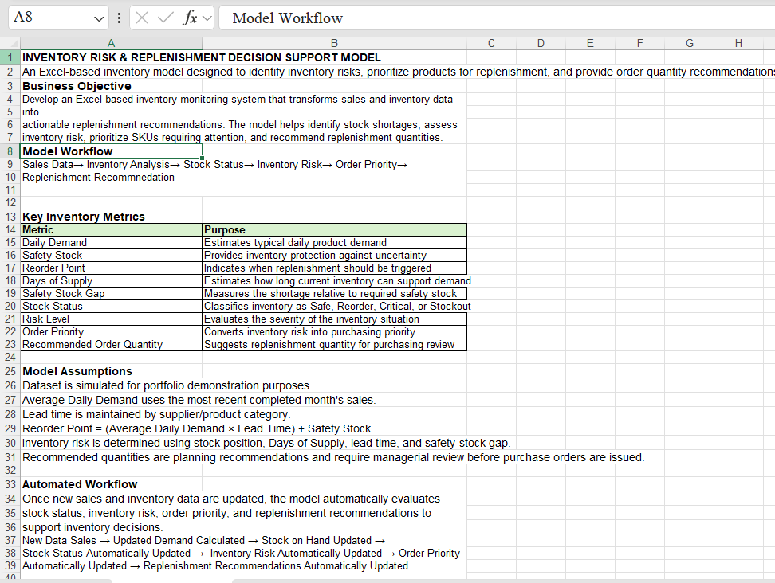
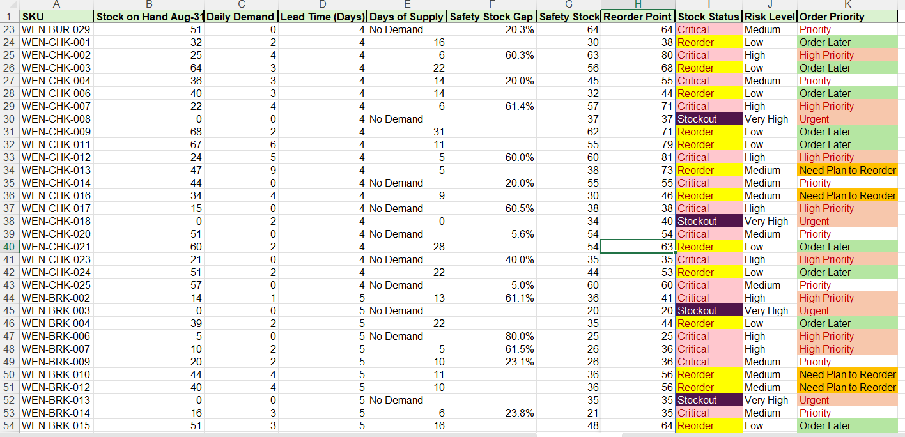
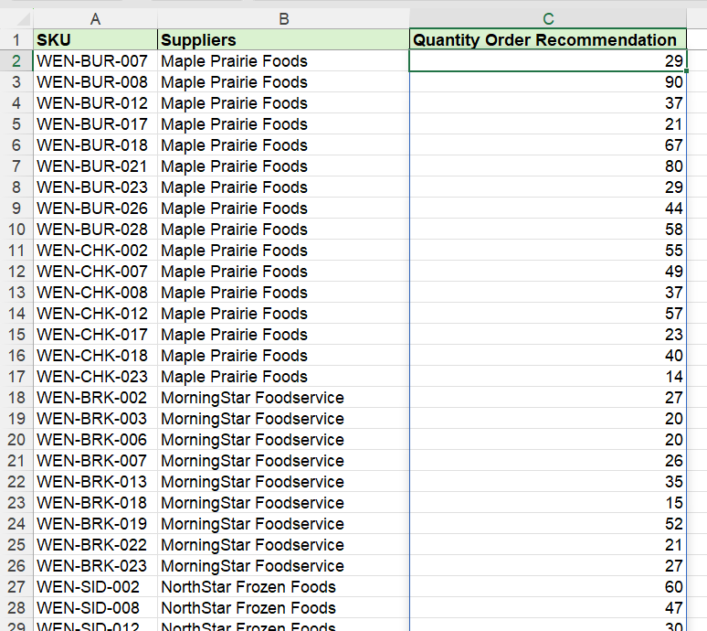

# Inventory-Replenishment-Excel-Project
Excel-based inventory risk and replenishment decision-support model using simulated restaurant data.
## Project Overview

This project is an Excel-based inventory decision-support model
designed to identify inventory risks, prioritize products for
replenishment, and provide order quantity recommendations.

The dataset is simulated for portfolio and learning purposes.

## Business Problem

Managing a large number of SKUs can make it difficult to quickly
identify products that are approaching stockout or require
replenishment.

This model converts sales and inventory data into actionable
inventory classifications and replenishment recommendations.

## Model Workflow

Sales & Inventory Data
→ Inventory Analysis
→ Stock Status
→ Inventory Risk
→ Order Priority
→ Replenishment Recommendation

## Key Inventory Metrics

- Daily Demand
- Safety Stock
- Reorder Point
- Days of Supply
- Safety Stock Gap
- Stock Status
- Inventory Risk Level
- Order Priority
- Recommended Order Quantity

## Excel Skills Used

- XLOOKUP
- SUMIF
- FILTER
- PRODUCT
- IFS
- Dynamic Arrays
- Conditional Formatting
- PivotTables
- PivotCharts

## Key Features

The model automatically updates downstream inventory classifications
when inventory inputs are changed.

Products are classified into stock statuses such as Safe, Reorder,
Critical, and Stockout.

Inventory risk and order priority are then evaluated to identify
products requiring immediate attention versus products that can
be planned for later replenishment.

## Project Files

📊 [Download the Excel Model](Inventory-Risk-Replenishment-Model.xlsx)

## Disclaimer

This project uses simulated data and was created independently
for portfolio and educational purposes. It is not affiliated with
Wendy's or any supplier represented in the dataset.

## Project Screenshots
### 1. Model Overview

The Model Overview explains the business objective, inventory metrics, model assumptions, and automated workflow.

---

### 2. Inventory Risk Analysis

The Inventory Risk model evaluates each SKU using stock position, daily demand, lead time, safety stock, reorder point, and days of supply.

Products are classified by **Stock Status, Risk Level, and Order Priority** to help identify inventory requiring management attention.

---

### 3. Replenishment Recommendations

Products requiring immediate replenishment are automatically identified and displayed with their supplier and recommended order quantity.

